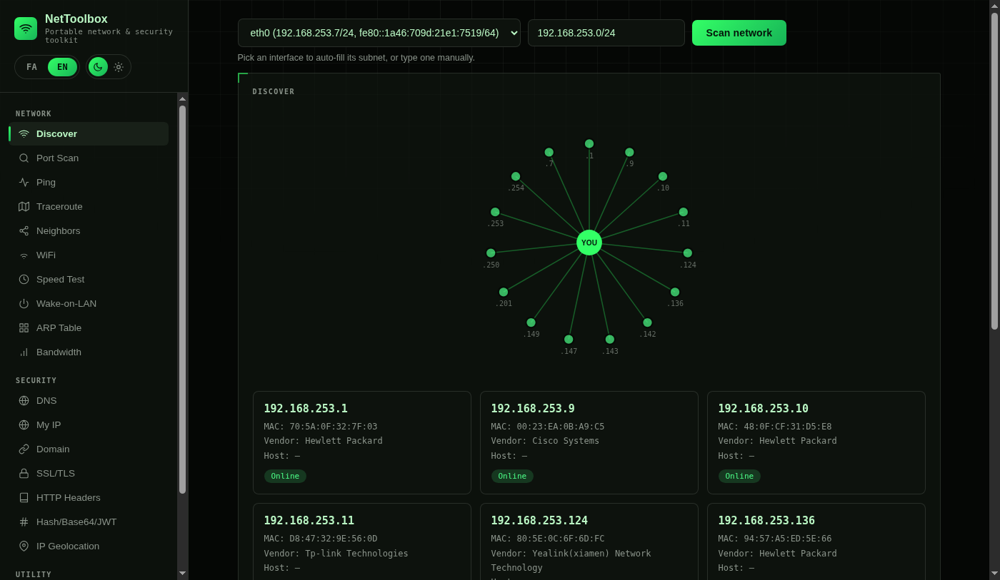

# NetToolbox

**v2** — a portable network & security dashboard you carry on your laptop. One Docker container, one web UI, works on whatever network you plug into — client site, home lab, or your own office.

[](LICENSE)




## Why

Field/network technicians end up carrying a pile of separate tools — a scanner, a terminal client, a certificate checker, a hash utility, a speed test site — usually a mix of platform-specific apps that don't travel well. NetToolbox puts the ones you actually reach for during a site visit behind one browser tab, in one container you can `docker build` anywhere Docker runs.

## Versions

| | [v1.0.0](https://github.com/sspiricco-dot/nettoolbox/releases/tag/v1.0.0) | **v2.0.0 (current)** |
|---|---|---|
| Discover, ping, traceroute, port scan | ✅ | ✅ |
| SSH/Telnet in the browser | ✅ | ✅ |
| SSL, headers, hash/JWT, DNS, WiFi, WoL | ✅ | ✅ |
| In-browser RDP | ❌ | ✅ |
| Link status (gateway / DNS / public IP) | ❌ | ✅ |
| Live MTR | ❌ | ✅ |
| Subnet calculator | ❌ | ✅ |
| Whois | ❌ | ✅ |
| Scan export (CSV / JSON) | ❌ | ✅ |
| Host profiles (protocol, port, notes) | ❌ | ✅ |

`main` is always **v2**. v1 stays as a git tag so you can still clone and build the original dashboard:

```bash
git clone --branch v1.0.0 https://github.com/sspiricco-dot/nettoolbox.git nettoolbox-v1
```

Releases: [v1.0.0](https://github.com/sspiricco-dot/nettoolbox/releases/tag/v1.0.0) · [v2.0.0](https://github.com/sspiricco-dot/nettoolbox/releases/tag/v2.0.0)

## Contents

- [Versions](#versions)
- [Features](#features)
- [Quick start](#quick-start)
- [Security notes](#security-notes)
- [Requirements](#requirements)
- [How it compares](#how-it-compares)
- [Tech stack](#tech-stack)
- [License](#license)

## Features

**Network**
- Link status at a glance — gateway, DNS, DHCP vs static, public IP
- Network discovery (ARP/ping sweep) with well-known port checks, topology view, and CSV/JSON export
- Port scanner (custom port list or full 1–65535 range)
- Ping with a one-shot check and a live latency monitor
- Traceroute and live MTR (hop loss and latency together)
- IPv4 subnet calculator (CIDR, usable hosts, typical gateway, split)
- Neighbor discovery — CDP (Cisco) and LLDP (standard)
- WiFi analyzer (nearby SSIDs, signal, frequency)
- Speed test (download/upload/ping via Cloudflare)
- Wake-on-LAN
- Local ARP table viewer
- Live bandwidth monitor (RX/TX per interface)

**Security**
- Multi-record DNS lookup (A, AAAA, MX, TXT, NS, CNAME, SOA)
- Whois lookup
- Public IP / IP geolocation lookup (yours or any IP)
- Domain recon: main A record + subdomains from public SSL certificate transparency logs (crt.sh) — fully passive
- SSL/TLS certificate inspector (works on self-signed/internal certs too)
- HTTP security header checker (HSTS, CSP, X-Frame-Options, etc.)
- Hash / Base64 / JWT toolkit — MD5, SHA-1/256/384/512, Base64 encode/decode, JWT decode, all client-side

**Utility**
- Host profiles — save name, protocol, port, username, and site notes (passwords are not stored)
- Full SSH/Telnet terminal in the browser (via [ttyd](https://github.com/tsl0922/ttyd))
- In-browser RDP (FreeRDP + noVNC) for Windows desktops on the LAN
- QR code generator for sharing an IP/URL with a phone

Bilingual UI (Persian/English), light and dark themes.

## Quick start

**v2 (current)**

```bash
git clone https://github.com/sspiricco-dot/nettoolbox.git
cd nettoolbox
docker build -t nettoolbox .
./run.sh
```

Then open **http://127.0.0.1:8642**.

`run.sh` starts the container with `--restart unless-stopped`, so it comes back automatically after a reboot as long as Docker itself is set to start on boot (`sudo systemctl enable docker` on Linux, or enable "Start Docker Desktop on login" on Mac/Windows).

**v1 (original dashboard)**

```bash
git clone --branch v1.0.0 https://github.com/sspiricco-dot/nettoolbox.git nettoolbox-v1
cd nettoolbox-v1
docker build -t nettoolbox:v1 .
```

Run it the same way with `./run.sh`. Use a different `--name` if v2 is already running.

## Security notes

This tool is intentionally powerful, so it's worth understanding what it does before running it on a machine you care about:

- **Host networking + `NET_ADMIN`/`NET_RAW`**: the container runs with `--net=host` and raw-socket capabilities so tools like `nmap`, `arp-scan`, and CDP/LLDP capture can see the real network your host is on. This is what makes it a useful field tool, but it also means the container has broad visibility into (and can send packets on) whatever network you plug into.
- **Dashboard, terminal, and RDP viewer are loopback-only.** The web UI (`:8642`), the browser terminal (`:7681`, via ttyd), and the noVNC RDP viewer (`:7682`) all bind to `127.0.0.1` inside the container — they are **not** exposed to the LAN you're connected to, even though the container itself has host networking. Only processes on your own machine can reach them.
- **A handful of tools call out to the internet**: Speed Test (Cloudflare), IP Geolocation / "My IP" (ipinfo.io), Domain recon's subdomain lookup (crt.sh), and Whois. Everything else (scanning, ARP, CDP/LLDP, SSH/Telnet, RDP, hashing) stays local.
- **The terminal is a real shell** with `ssh`/`telnet` clients and your container's privileges — treat it like any other terminal you carry around.
- **RDP passwords** are sent to FreeRDP on stdin (not on the command line). Internal/self-signed certificates are ignored, same as you'd do on a field box.

Because of the above, only run this on hardware you control, and don't publish the dashboard port beyond loopback.

## Requirements

- Docker
- Linux host recommended (host networking works most predictably there; on Mac/Windows via Docker Desktop, host networking support varies by version)

## How it compares

| | NetToolbox | [NETworkManager](https://github.com/BornToBeRoot/NETworkManager) | Angry IP Scanner | Fing |
|---|---|---|---|---|
| Platform | Any (Docker) | Windows only | Cross-platform | Mobile + desktop |
| Interface | Browser | Native WPF app | Native app | Native app |
| Install footprint | One container | .NET/WPF install | Java runtime | App install |
| SSH/Telnet client | ✅ (in-browser) | ✅ | ❌ | ❌ |
| RDP client | ✅ (in-browser) | ✅ | ❌ | ❌ |
| Cert/header/hash tools | ✅ | ❌ | ❌ | ❌ |
| Self-hosted, no account | ✅ | ✅ | ✅ | Partial (account for some features) |

NetToolbox trades NETworkManager's much larger native feature set (VNC, PowerShell remoting, profile encryption) for being cross-platform and running from a single container — it's a narrower, more portable tool, not a replacement for a full Windows network-admin suite.

## Tech stack

- Backend: Python/Flask, calling out to `nmap`, `arp-scan`, `tshark`, `dig`, `openssl`, `iw`, `traceroute`, `curl`
- Frontend: single-file HTML/CSS/JS, no build step, no external CDN dependencies
- Terminal: [ttyd](https://github.com/tsl0922/ttyd)
- RDP: [FreeRDP](https://github.com/FreeRDP/FreeRDP) + [noVNC](https://github.com/novnc/noVNC) on a headless X display
- QR codes: [qrcode-generator](https://github.com/kazuhikoarase/qrcode-generator) by Kazuhiko Arase (MIT), bundled in `static/qrcode.js`

## License

MIT — see [LICENSE](LICENSE).
